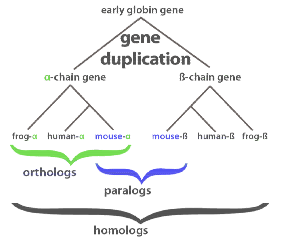
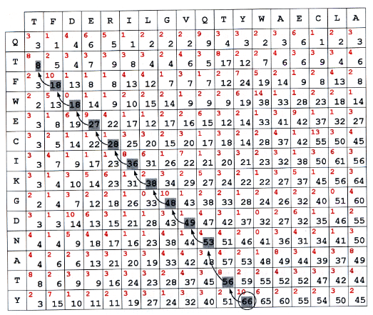

# Sequences

## Evolution

What does __Molecular Evolution__ means?

Something changes in the "material" coming up with something else, "branching" from the original element along the timeline representing the lifetime of the elements

the mutation can result in something better or something that can be deadly for the newbe (survival of the fittest)

__Simmetry__ is a dominant trait in the sistem

### Fundamental Mechanism

The system composed by _DNA->RNA->Protein_ was dominant among all the others and became the main base from which evolution started

### Main features

* Mutation
* Randomness
* Time
* Selection
* Constraints (_physical_)

Based on what we are seing right now we infer what came before us

> The study of changes occurring in DNA and in its products is the object of study of __Molecular Evolution__

Sequence-wise we cannot infer something basing ourselves only on positional informations because it could be a case of pure coincidence

### Gene Duplication

main terms

* orthologs (strong relationship) (a gene has the same function in different organisms)
* paralogs (weak relationship)
* homologs (deriving from the same tree)

## Sequence Alignment

> Final goal: structural Alignment
>
> * align two sequences
> * find positionally and sequentially identical part

Sequence alignment have to deal with probabilistic similarities

Random sequences can have a 5-10% "similarity index"

### Alignment

Main paradigms

* Similarity matrix
* Gap cost
* both previous points concurr in the creation of the "__Dynamic Programming Algorithm__"

#### Visualizing alignment

Software [Jalview](http://www.jalview.org/)

#### Dot matrix

each sequence is aligned to a side of the matrix. When there is a match between the x and y axis the point of the matrix is filled with a dot

To prevent checking the whole matrix a __Sliding window__ is used

With approximation noise becomes more blurry and the useful information is highlighted ([Blosum 62](http://www.uky.edu/Classes/BIO/520/BIO520WWW/blosum62.htm) => a particular matrix to overlap to the original one)

### Dynamic programming

The alignment is computed in 2 steps

* Computation of the best solution in every box
* _Backtracking_: choice of the optimal path on the basis of data computed in the boxes

The difference  between _global_ and _local_ alignment stands in box filling and in the choice of the backtracking starting point

### Global Alignment

_Notation_:

* x_i = i-th element of the sequence x
* y_j = j-th element of the sequence y
* x_(1..i) = Prefix of x from 1 to i
* F = optimal score matrix
  * F(i,j) = optimal alignment x_(1..i) with y_(1..j)
* d = gap penalty
* s = scoring matrix

#### Algorithm

1. Build __F__
2. Initialize F(0,0) = 0; F(i,0) = -d*i; F(0,j)= -d*j
3. Fill the table from top-left to bottom-right corner using the recursive relationship F(i,j) = max( F(i-1,j-1)+s(x_i,y_i) , F(i-1,j)-d , F(i,j-1)-d )

#### Backtracking

The path always starts from the last cell. By definition it ends at the cell(1,1).

Shifts:

* Diagonal - both
* Up - gap up
* Sx - gap down