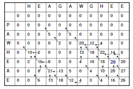
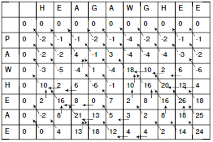
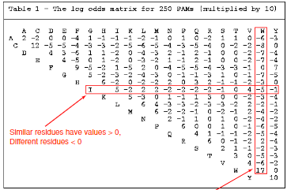
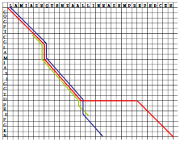
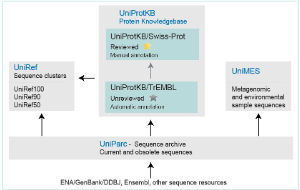
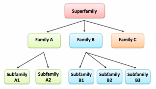
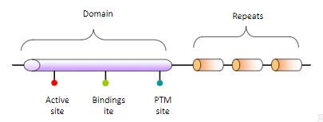

# Sequences

## Evolution

What does __Molecular Evolution__ means?

Something changes in the "material" coming up with something else, "branching" from the original element along the timeline representing the lifetime of the elements

the mutation can result in something better or something that can be deadly for the newbe (survival of the fittest)

__Simmetry__ is a dominant trait in the sistem

### Fundamental Mechanism

The system composed by _DNA->RNA->Protein_ was dominant among all the others and became the main base from which evolution started

### Main features

* Mutation
* Randomness
* Time
* Selection
* Constraints (_physical_)

Based on what we are seing right now we infer what came before us

> The study of changes occurring in DNA and in its products is the object of study of __Molecular Evolution__

Sequence-wise we cannot infer something basing ourselves only on positional informations because it could be a case of pure coincidence

### Gene Duplication

main terms

* orthologs (strong relationship) (a gene has the same function in different organisms)
* paralogs (weak relationship)
* homologs (deriving from the same tree)

## Sequence Alignment

> Final goal: structural Alignment
>
> * align two sequences
> * find positionally and sequentially identical part

Sequence alignment have to deal with probabilistic similarities

Random sequences can have a 5-10% "similarity index"

### Alignment

Main paradigms

* Similarity matrix
* Gap cost
* both previous points concurr in the creation of the "__Dynamic Programming Algorithm__"

#### Visualizing alignment

Software [Jalview](http://www.jalview.org/)

#### Dot matrix

each sequence is aligned to a side of the matrix. When there is a match between the x and y axis the point of the matrix is filled with a dot

To prevent checking the whole matrix a __Sliding window__ is used

With approximation noise becomes more blurry and the useful information is highlighted ([Blosum 62](http://www.uky.edu/Classes/BIO/520/BIO520WWW/blosum62.htm) => a particular matrix to overlap to the original one)

### Dynamic programming

The alignment is computed in 2 steps

* Computation of the best solution in every box
* _Backtracking_: choice of the optimal path on the basis of data computed in the boxes

The difference  between _global_ and _local_ alignment stands in box filling and in the choice of the backtracking starting point

### Global Alignment

_Notation_:

* x_i = i-th element of the sequence x
* y_j = j-th element of the sequence y
* x_(1..i) = Prefix of x from 1 to i
* F = optimal score matrix
  * F(i,j) = optimal alignment x_(1..i) with y_(1..j)
* d = gap penalty
* s = scoring matrix

#### Algorithm

1. Build __F__
2. Initialize F(0,0) = 0; F(i,0) = -d*i; F(0,j)= -d*j
3. Fill the table from top-left to bottom-right corner using the recursive relationship F(i,j) = max( F(i-1,j-1)+s(x_i,y_i) , F(i-1,j)-d , F(i,j-1)-d )

#### GA-Backtracking

The path always starts from the last cell. By definition it ends at the cell(1,1).

Shifts:

* Diagonal - both
* Up - gap up
* Sx - gap down

### Local Alignment

Discovered a decade after the __global alignment__

F(i,j) = max( 0, F(i-1,j-1)+s(x_i,y_j), F(i-1,j)-d, F(i,j-1)-d)

Local Alignment focuses on region where similarities are

#### LA-Backtracking

The Traceback always starts from the cell with the highest score

### Semi-Global Alignment

Matrix initialization (first row or column) is done with 0s as in the “local” alignment

Matrix compilation is done as in the “global” alignment

#### SGA-Backtracking

Traceback always starts from the last row or column

> Semi Global Alignment isn't as used as the prev ones since Local Alignment already does most of the work

---

> Setting the upper-left side to 0s "frees" the match of the left side of the two sequences
>
> Forcing to start from the low-right corner forces the match of the right side of the two sequences
>
> Both properties are symmetrical

### Suboptimal Alignment

Sometimes it may be useful to have more than one alignment for two sequences. These alignments are called suboptimal.

It is possible to compute them using small variations during the backtracking phase. This phase is then reiterated to get different alignments, up to a __threshold__ T

### Similarity Matrices

__Similarity matrices__ are tables associating a similarity value to each substitution

The most common matrices are based on statistical methods indicating _the substitution frequency among aminoacids in homologous protein families_

Given p_a as the probability of finding residue a, the probability of a random substitution between residues is computed as the probability of two independent events => C(a,b) = p_a * p_b

Probability of a mutation between amminoacids a and b is observed on a set of homolog sequences => M(a,b) = p_(a,b)

The relationship between _match_ and _random_ can be expressed as "likelihood" or "odds ratio" => M(a,b)/C(a,b)

To keep the odd ratio more stable and get a larger number, we take the logarithm

#### PAM matrices

__PAM__ = Point accepted mutation

Matrices are built on homologous sequences showing only 1% of accepted mutations

Two sequences are at 1 PAM of distance if, on average, one mutation on 100 amminoacids has been detected.

#### Blosum matrices

__BLOSUM__ = Blocks Amino Acid Substitution Matrices

Blosum is calculated with the same formula of PAM, but has better performances being based on direct observations

The number after BLOSUM name is the percentage of sequence identities that are held by the matrix

### Affine Gap Costs

Two parameters are used for gaps:

* __Gap open__ (γ) = opening the first gap of an indel
* __Gap extension__ (δ) = extending an already existing indel

Gap penalty:d = γ + δ * (length(i)– 1)

## Alignment differences

* __Global Alignment__ (_red_) impose an alignment which involves all the residues of the two sequences, no matter their similarity
* __Local Alignment__ (_green_) on the other hand allows to align only most similar residues of the two sequences
* __Semiglobal Alignment__ (_blue_) tries to combine both methods

## Multiple sequence alignments

Purposes:

* Demonstrate homology
* Molecular phylogeny
* Structural prediction
* Functional prediction
* Identification of functionally important sites

other thoughts:

* Usage of algorithms for the search of an optimal alignment between two sequences creates problems in its generation
> __If L is the length of the sequences, it would take O(L^N) units of time to align N sequences. Not feasible!__
* Usageof euristic methods or progressive based on the hypotesis that the sequences to be aligned are phylogenetically correlated

### CLUSTALW

1. __Pairwise alignment__ of all the starting sequences with:
    * Approximate methods (n-tuple)
    * Dynamic algorithm
2. Scoring of the alignment used to build the __phylogenetic tree__
3. __Progressive alignment__ of the sequences according to the tree order

> The tree is a dendogram of priority for the pairwise alignment of multiple sequences

Features:

* Sequence weighting
* Matrix score
* Special gap score

### Progressive methods: disadvantages

* Once an alignment is fixed is not modified in the subsequent steps. In particular, the gap location cannot change
* Initial errors are propagated in subsequent steps
* Initial phylogenetic trees are derived from distance matrices between pairs of independently aligned sequences. These are less reliable than phylogenetic trees derived from complete multiple sequence alignments
* Alignment errors depend on sequence similarities. Care must be taken in selecting input sequence to be real homologs and of comparable length to avoid the insertion of too many gaps
* If sequences are too divergent (< 25-30% sequence identity) progressive methods become unreliable

### Other "multiple alignment" methods

* [CLUSTAL-OMEGA](http://www.ebi.ac.uk/Tools/msa/clustalo/) has replaced CLUSTALW
* [T-COFFEE](http://www.tcoffee.org/)
* [MAFFT](http://www.ebi.ac.uk/Tools/msa/mafft/)

## Sequence databases

### [Uniprot](http://www.uniprot.org/)

* EMBL-EBI (european bioinformatics institute)
* SIB (swiss institute of bioinformatics)
* PIR (protein information resource)

__Swiss-Prot__ manually annotated and reviewed

vs

__TrEMBL__ automatically annotated and not reviewed

### [InterPro](http://www.ebi.ac.uk/interpro)

Proteins can be classified into different groups based on:

* The __FAMILIES__ to which they belong
* The __DOMAINS__ they contain
* The __SEQUENCE FEATURES__ they possess

> A protein family is a group of proteins that share a common evolutionary origin

> Domains are distinct functional and/or structural units in a protein

Usually they are responsible for a particular function or interaction, contributing to the overall role of a protein

Domains may exist in a variety of biological contexts, where similar domains can be found in proteins with different functions

> Sequences features are group of amino acids that confer certain characteristics upon a protein, and may be important for its overall function

#### [Pfam](http://pfam.xfam.org/)

one of the most relevant InterPro database

Collection of multiple sequence alignment based on Hidden Markov Models